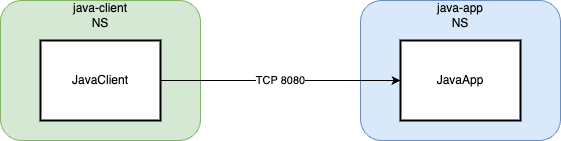

## 1. Install a simple application

### a. The application diagram is shown below: 

<p align="center">
  
</p>

### b. Clone the Observability Clinic Repo and grant the executable permission for the lab's script
```bash
git clone https://github.com/tigera-solutions/visualizing-and-troubleshooting-traffic-and-network-policy-issues-for-AKS.git
```
```bash
cd visualizing-and-troubleshooting-traffic-and-network-policy-issues-for-AKS
chmod +x workshop1/lab-script.sh 
```

### c. Create a namespace 'java-app' which the application will be deployed in:

```bash
kubectl create namespace java-client
kubectl create namespace java-app
```

### d. Deploy the application java-app to the namespace.

```bash
kubectl apply -n hipstershop -f apps/
```

## 2. Install a complex application

### a. The application diagram is shown below: 

<p align="center">
  
</p>

| Deployment Name         | Label                     | Service Port/Proto  |
| :-----------:           | :-------------:           | :-----------------: |
| adservice               | app=adservice             | 9555/TCP            |
| cartservice             | app=cartservice           | 7070/TCP            |
| checkoutservice         | app=checkoutservice       | 5050/TCP            |
| currencyservice         | app=currencyservice       | 7000/TCP            |
| emailservice            | app=emailservice          | 5000/TCP            |
| frontend                | app=frontend              | 80/TCP              |
| loadgenerator           | app=loadgenerator         |                     |
| paymentservice          | app=paymentservice        | 50051/TCP           |
| productcatalogservice   | app=productcatalogservice | 3550/TCP            |
| recommendationservice   | app=recommendationservice | 8080/TCP            |
| redis-cart              |app=redis-cart             | 6379/TCP            |
| shippingservice         | app=shippingservice       | 50051/TCP           |


### b. Create a namespace 'hipstershop' which the application will be deployed in:

```bash
kubectl create namespace hipstershop
```
### c. Deploy the application Online Boutique (Hipstershop) to the namespace. This will install the application from the Google repository.

```bash
kubectl apply -n hipstershop -f https://raw.githubusercontent.com/GoogleCloudPlatform/microservices-demo/v0.3.9/release/kubernetes-manifests.yaml
```

### d. Wait for all PODs get in a running status

```bash
watch kubectl get pods -n hipstershop
```
```bash
NAME                                     READY   STATUS    RESTARTS   AGE
adservice-6f498fc6c6-c5rhh               1/1     Running   0          2m40s
cartservice-bc9b949b-rgqpc               1/1     Running   0          2m40s
checkoutservice-598d5b586d-nxjck         1/1     Running   0          2m41s
currencyservice-6ddbdd4956-vjzs8         1/1     Running   0          2m40s
emailservice-68fc78478-qg8qp             1/1     Running   0          2m41s
frontend-5bd77dd84b-l8qqx                1/1     Running   0          2m41s
loadgenerator-8f7d5d8d8-d7gwj            1/1     Running   0          2m40s
paymentservice-584567958d-hr5vl          1/1     Running   0          2m41s
productcatalogservice-75f4877bf4-jvnlq   1/1     Running   0          2m40s
recommendationservice-646c88579b-2t55b   1/1     Running   0          2m41s
redis-cart-5b569cd47-l29tx               1/1     Running   0          2m40s
shippingservice-79849ddf8-nlfjv          1/1     Running   0          2m40s
```

### e. Configure the ingress 

```bash
sed -i "s,template,$(kubectl cluster-info | grep -i control | awk -F "://" '{print $2}' | cut -d. -f1),g" /home/tigera/observability-clinic/tsworkshop/workshop1/manifests/1-ingress-nginx-hipstershop.yaml
kubectl apply -f /home/tigera/observability-clinic/tsworkshop/workshop1/manifests/1-ingress-nginx-hipstershop.yaml
```

### f. Browse the URL shown in the command’s output below to test the Hipstershop Application:

```bash
echo https://hipstershop.$(kubectl cluster-info | grep -i control | awk -F "://" '{print $2}' | cut -d. -f1).lynx.tigera.ca
