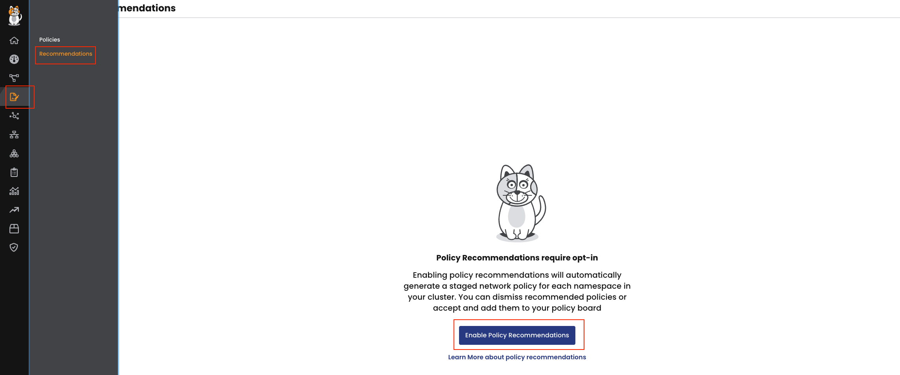
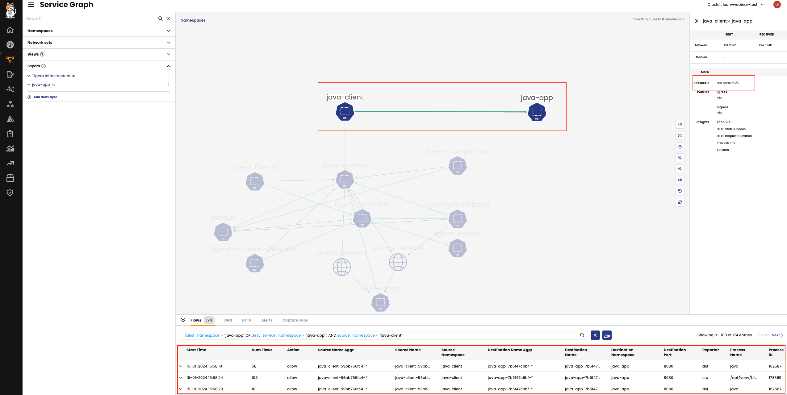
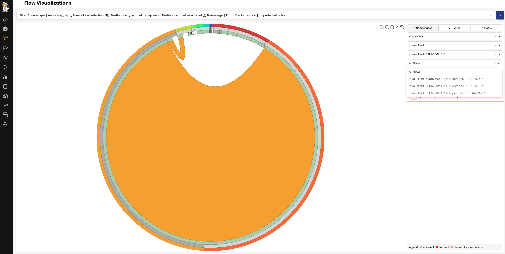
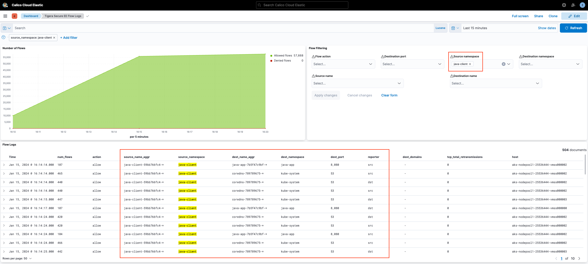
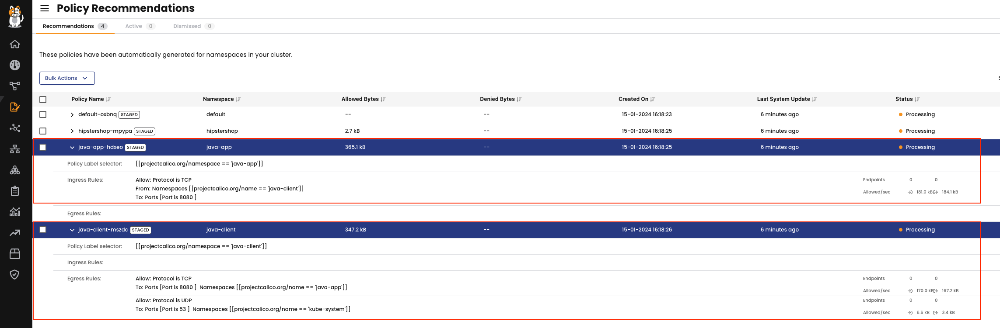
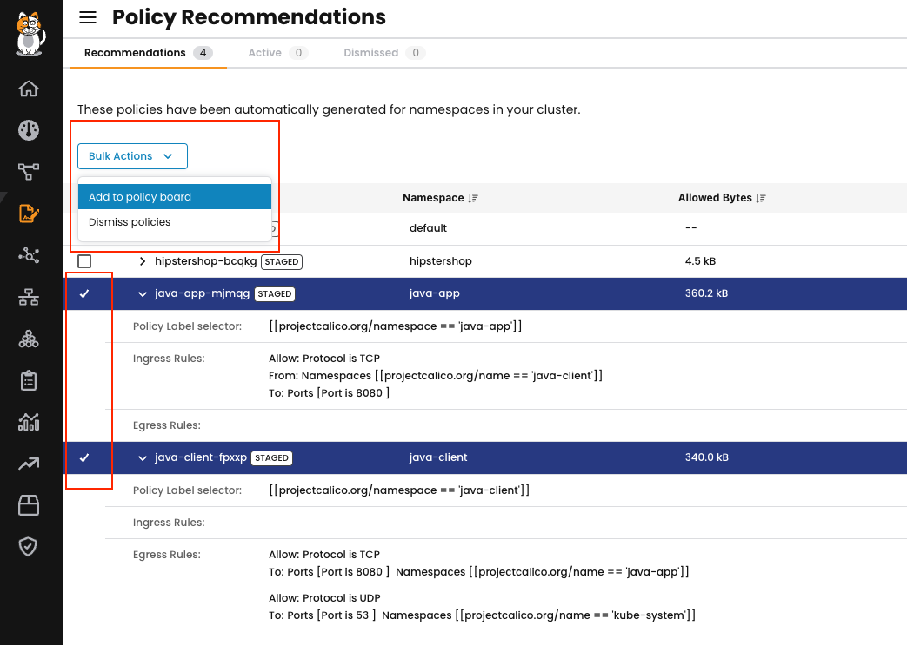
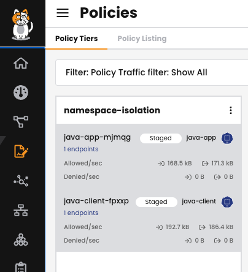

## 1. Secure the simple application

### Automated Approach
#### a. Enable Policy Recommendation in the cluster

i. On the left hand navigation bar select the **Policies**  icon  
ii. Choose **Recommendations**  
iii. Click **Enable Policy Recommendations**  

  

This will enable real-time policy recommendation which we will come back to at the end of this module  

### Manual Approach
#### a. Check Service-Graph for flow-information

  

#### b. Check FlowViz for flow-information

  

#### c. Check Kibana for flow-information

  

### Automated Approach revisited

#### a. Check the recommended policies  

  

#### b. Apply the recommended policies into the cluster

  

#### b. Monitor the staged policy

  

#### c. Enforce the recommended policy

  
  

