# Module 2 - Investigate denied flows using the Calico Cloud UI


## 1. Identify denied flows using the Dynamic Service and Threat Graph

### Demo

#### a. Opening the lab and run the script below:

```bash
/home/tigera/observability-clinic/tsworkshop/workshop1/lab-script.sh
```

#### b. Typing the option “1” (Demo Break Online Boutique - Dynamic Service and Threat Graph) and press “Enter”

#### c. Type "99" and enter to exit

#### d. Open the Online Boutique with the URL shown through the command below and select any product:
```bash
echo https://hipstershop.$(kubectl cluster-info | grep -i control | awk -F "://" '{print $2}' | cut -d. -f1).lynx.tigera.ca
```

<p align="center">
  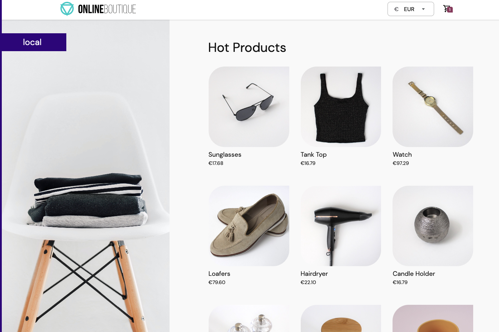
</p>

#### e. Add the product to the Cart:

<p align="center">
  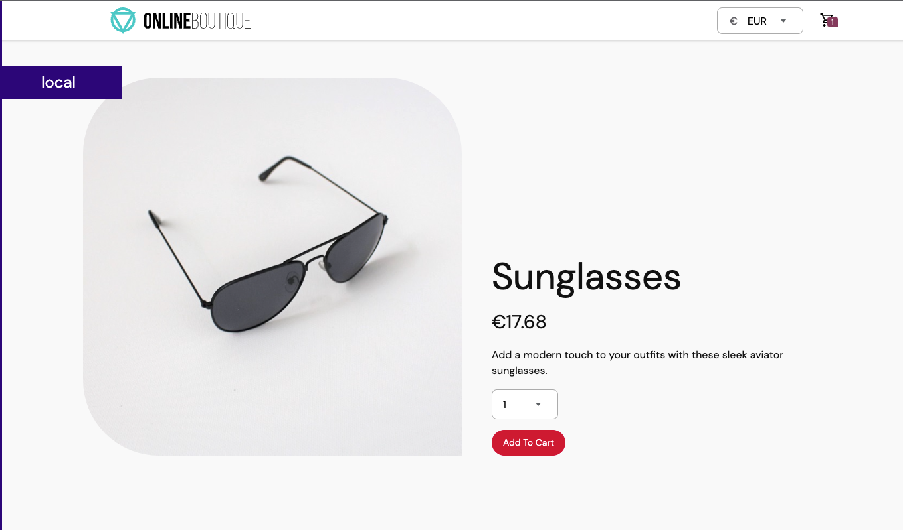
</p>

#### f. Click place order:

<p align="center">
  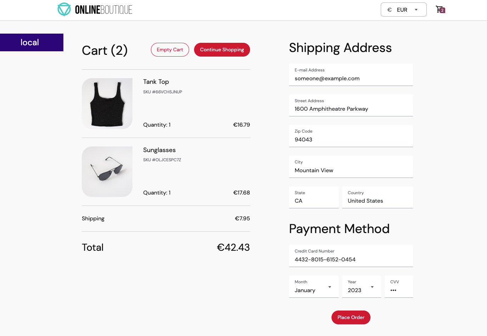
</p>

#### g. The request didn’t complete and return HTTP 500 Internal error:

```nano
HTTP Status: 500 Internal Server Error

rpc error: code = Internal desc = failed to charge card: could not charge the card: rpc error: code = Unavailable desc = connection error: desc = "transport: Error while dialing dial tcp 10.49.11.61:50051: i/o timeout"
failed to complete the order
```
<p align="center">
  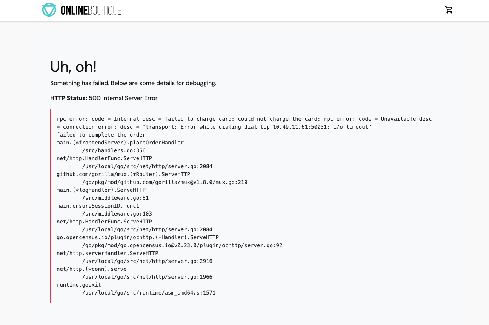
</p>

#### h. Why not take some time to try to solve this issue yourself before continuing further

#### i. Go to the Dynamic Service and Threat Graph in the hipstershop namespace, where the Online Boutique application is running (Calico Cloud login ->  -> Views: Default -> Double-click on hipstershop ns   )

<p align="center">
  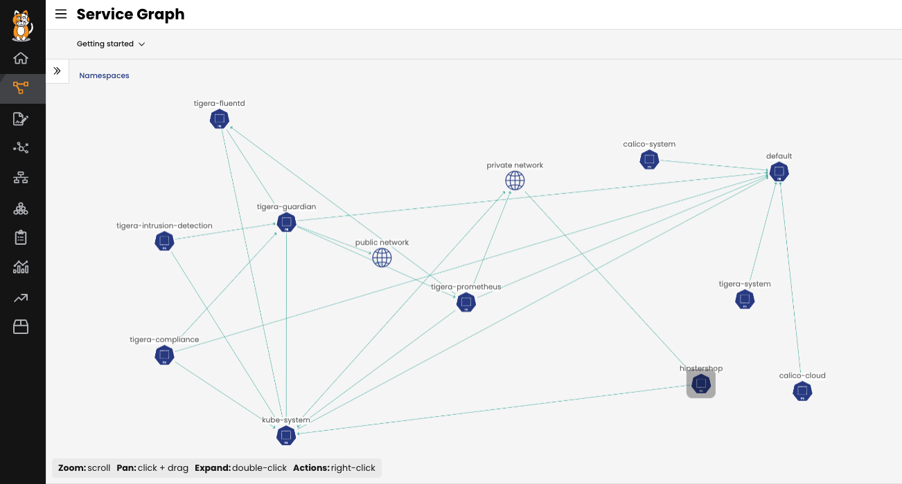
</p>

#### j. From the Online Boutique Diagram, we can see that the CheckoutService will send the request to PaymentService:

<p align="center">
  
</p>

#### k. Therefore, we can see some red arrows between the checkoutservice and paymentservice and, when we pass on the cursor under red arrow we can see denied flows in red:

<p align="center">
  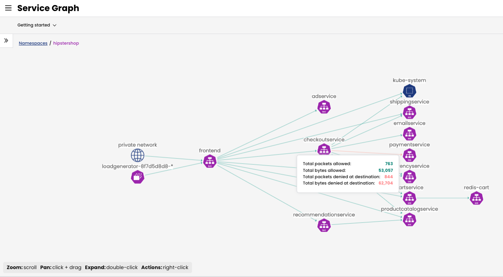
</p>

#### l. By selecting the red arrow, it will show the flows related to that arrow on the bottom of the screen:

<p align="center">
  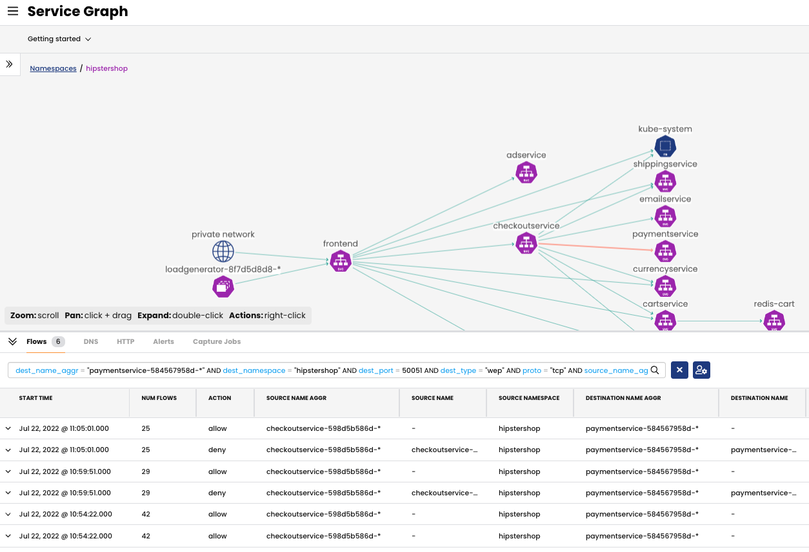
</p>

#### m. When we expand one denied flow from checkoutservice to paymentservice, it shows many information and scrolling down we can see the Action =  Deny and the Policies = *“0|security|security.tenant-histershop|pass|0, 1|default|default.default-deny|deny|-1”*. This policy entry means that the flow did not match with any Security Policy rule configured and it ended up on an implicit default deny.

<p align="center">
  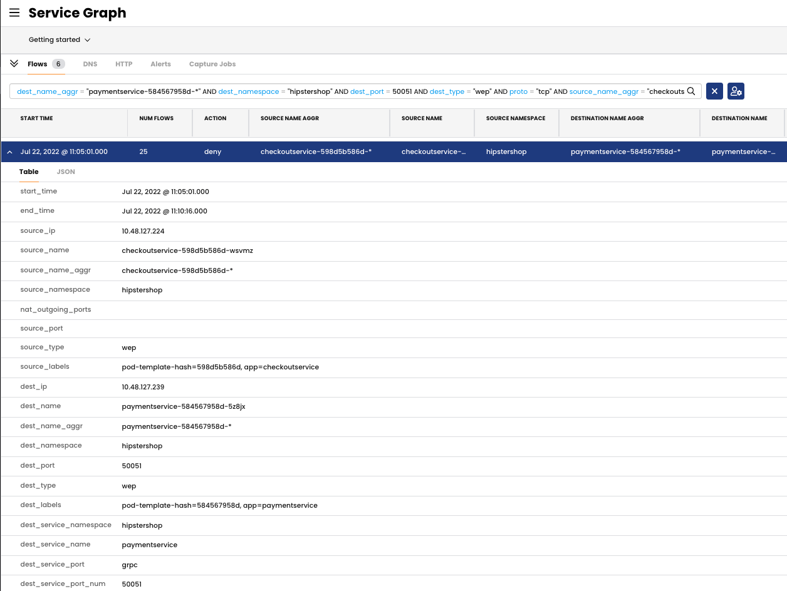
</p>

<p align="center">
  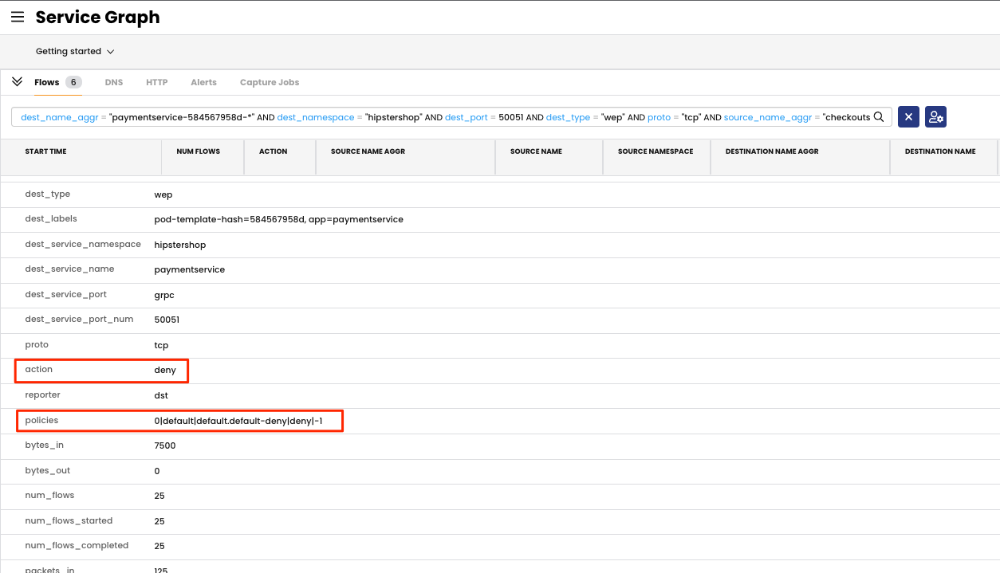
</p>

#### n. As the flow did not match with security policy, let’s review the Security Policy created for the paymentservice.

#### o. When opening the Security Policy paymentservice, we can see that "0" Endpoints are associated with that policy:

<p align="center">
  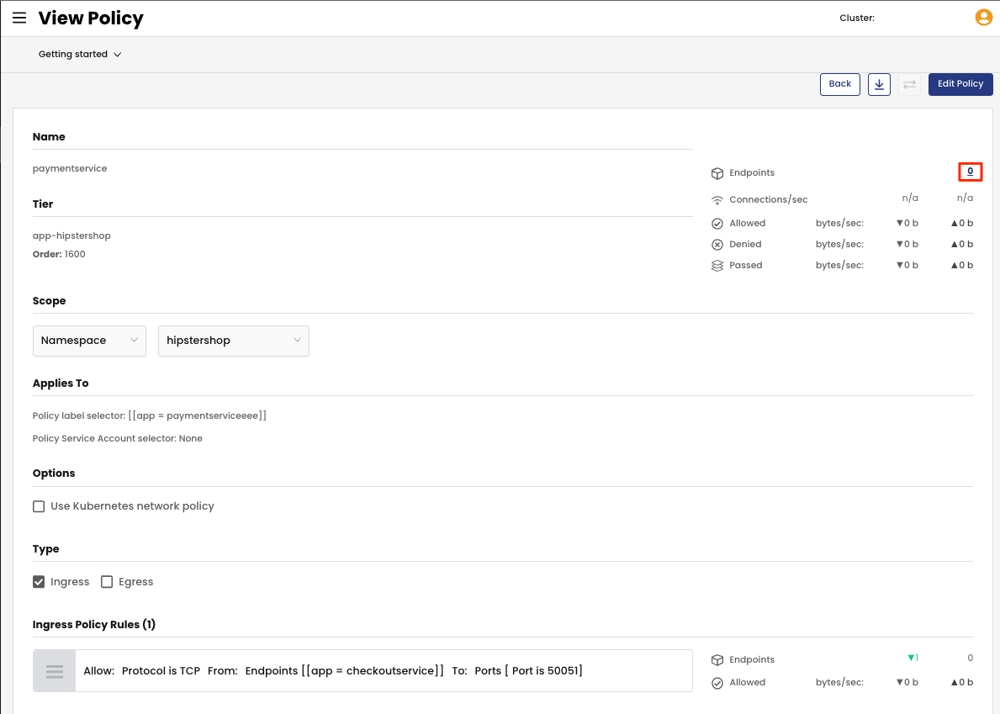
</p>

#### p. As the recommended way to match endpoints to Security Policy are labels, let’s check the labels from the paymentservice pod as per command below (the label can also be checked through the Tigera UI in Endpoint tab):

```bash
kubectl get po -n hipstershop --show-labels | grep payment
```
```bash
paymentservice-584567958d-5z8jx          1/1     Running   1 (38h ago)   7d    app=paymentservice,pod-template-hash=584567958d
```

#### q. We can see the label of the payment pod is app=paymentservice and in the Security Policy the label configured is app=paymentserviceee. Therefore there is a typo on the Security Policy label.

<p align="center">
  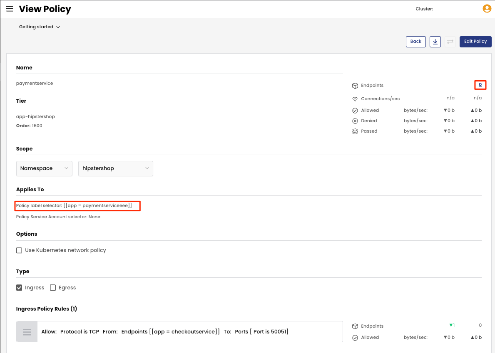
</p>

#### r. After editing the Security Policy and inserting the right label for the paymentservice pod (app=paymentservice), we can see the Endpoints in the Security Policy shows “1”.

<p align="center">
  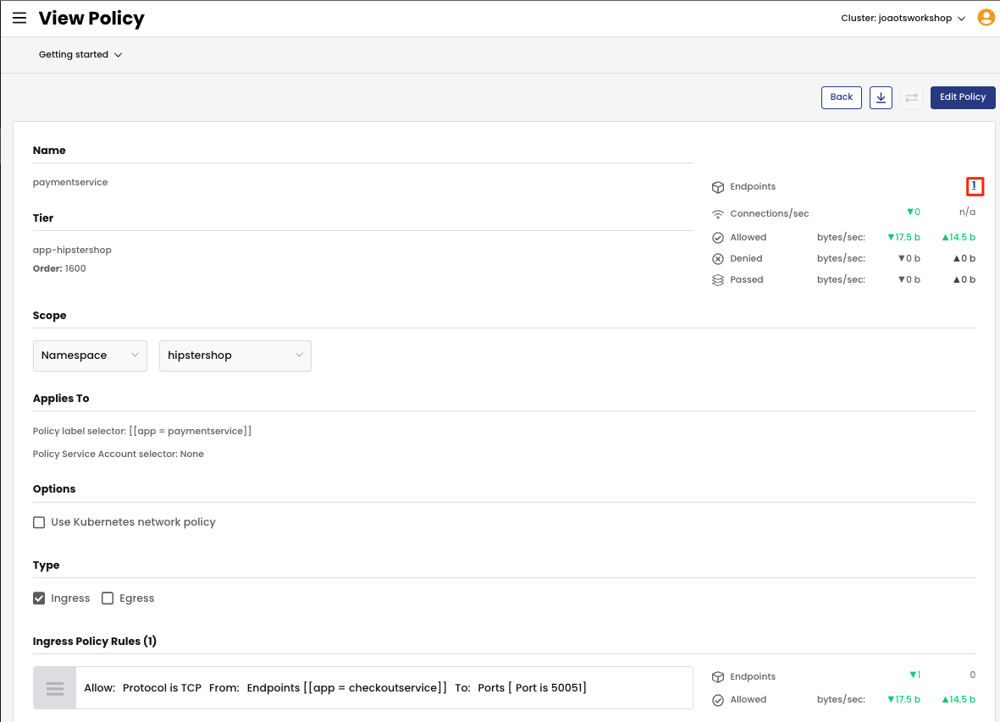
</p>

#### s. If we click on the “1” it will show the endpoint enforced by the Security Policy, in this case the paymentservice pod.

<p align="center">
  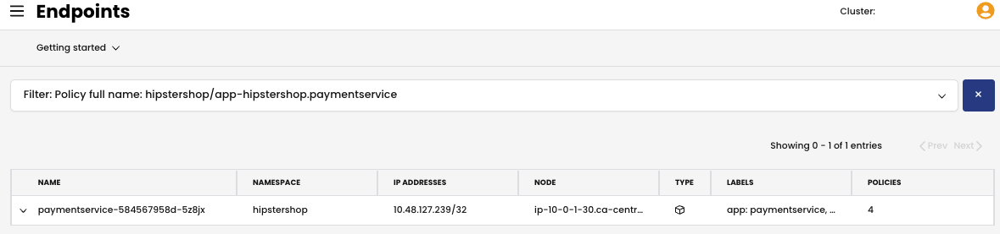
</p>

#### t. After fixing the paymentservice label, we click on “Place Order” and it is completed (alternatively if you are still on the error 500 page, simply refresh the page):

<p align="center">
  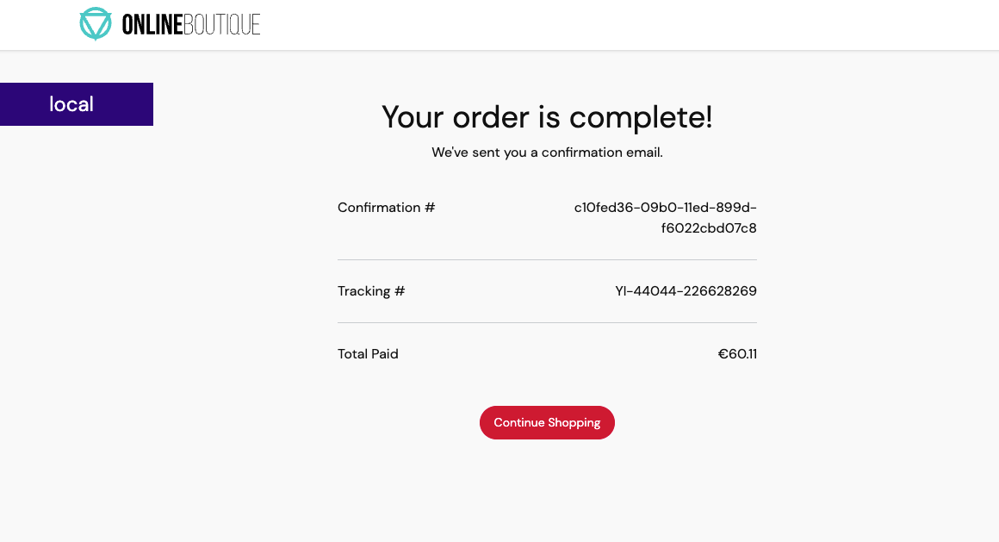
</p>

### LAB

#### a. Open the lab and run the script below:

```bash
/home/tigera/observability-clinic/tsworkshop/workshop1/lab-script.sh
```
#### b. Type the option “2” (LAB Break Online Boutique - Dynamic Service and Threat Graph) and press “Enter”

#### c. Type "99" and enter to exit

#### d. Open the browser with the URL shown through the command below:

```bash
echo https://hipstershop.$(kubectl cluster-info | grep -i control | awk -F "://" '{print $2}' | cut -d. -f1).lynx.tigera.ca
```

#### e. Change the currency = EUR and select any product:

<p align="center">
  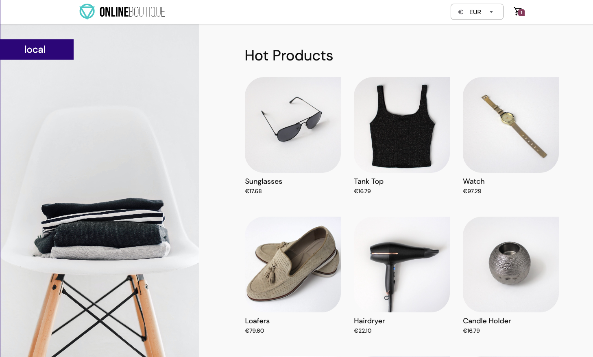
</p>

#### f. Add any product to the Cart:

<p align="center">
  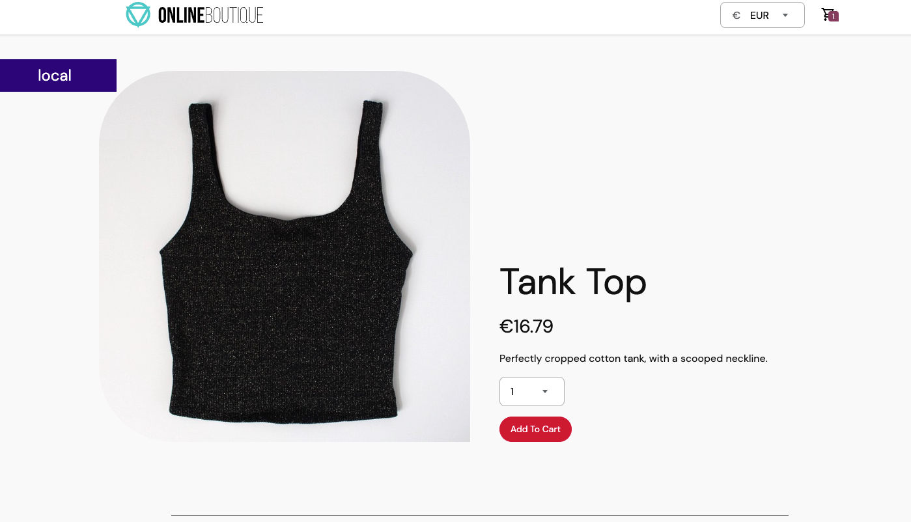
</p>

#### g. Place the Order:

<p align="center">
  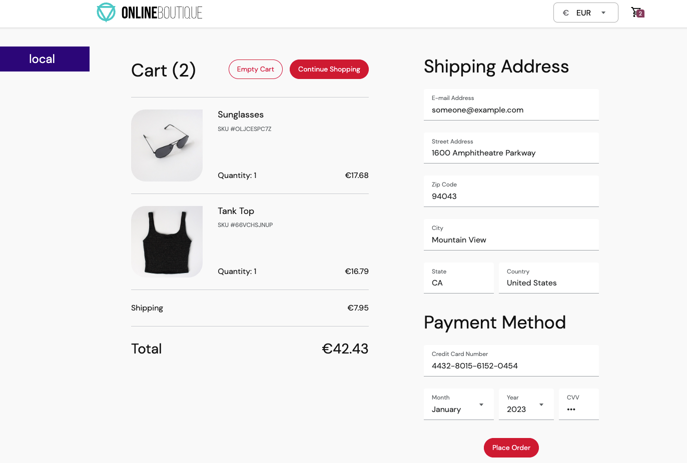
</p>

#### h. The internal error below will return on converting the price to EUR:

```nano
HTTP Status: 500 Internal Server Error

rpc error: code = Internal desc = failed to prepare order: failed to convert price of "XXXXXXXXXX" to EUR
failed to complete the order
```

<p align="center">
  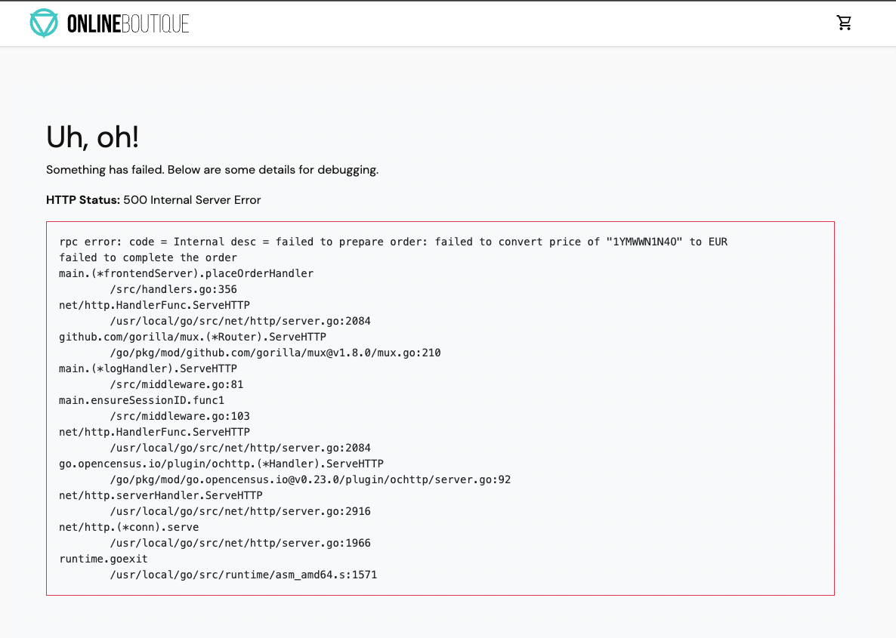
</p>

#### i. Investigate through the Dynamic Service and Threat Graph which flows have been denied and the Security Policy related to it, and how to fix this issue. Use the hipstershop application information provided in the **[Module 1 - Topic 4](https://github.com/tigera-cs/observability-clinic/blob/main/1.%20Overview/readme.md#4-install-hipstershop-application)**. 

#### j. To revert back the misconfiguration applied, run the script and type “21” (LAB Fix Online Boutique - Dynamic Service and Threat Graph) and press Enter. To exit type "99" and press “Enter”.

## 2. Identify denied flows using the Flow Visualizations

### Demo

#### a. Opening the lab and run the script below:

```bash
/home/tigera/observability-clinic/tsworkshop/workshop1/lab-script.sh
```

#### b. Typing the option “3” (Demo Break Online Boutique - Flow Visualizations) and press “Enter”

#### c. Type "99" and “Enter” to exit

#### d. Opening the Online Boutique with the URL shown through the command below and Trying to access the Online Boutique we get the error: *“504 Gateway Time-out”*

```bash
echo https://hipstershop.$(kubectl cluster-info | grep -i control | awk -F "://" '{print $2}' | cut -d. -f1).lynx.tigera.ca
```

#### e. On Tigera-UI >  > Flow Visualizations, we can select the Denied flows in the Status field:

<p align="center">
  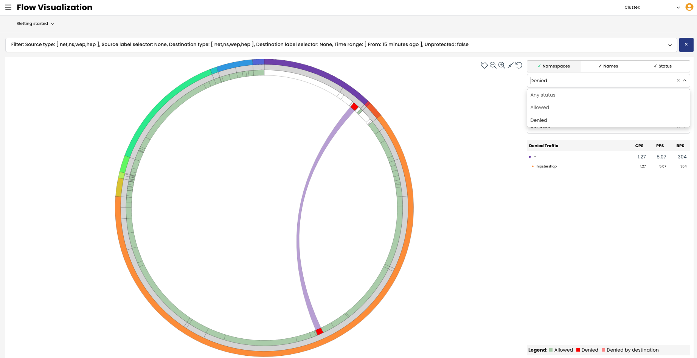
</p>

#### f. When selecting the Denied flow in the Flow Visualizations, the details about this flow shows in the right side of the screen. If we click on the “All Flows” dropdown, we can see the Denied flow from pvt (private network) to frontend illustrated with a red arrow.  Select this flow to see more information about it. Now we can see that the Security Policy that is denying this flow is hipstershop.app-hipstership.fronted

<p align="center">
  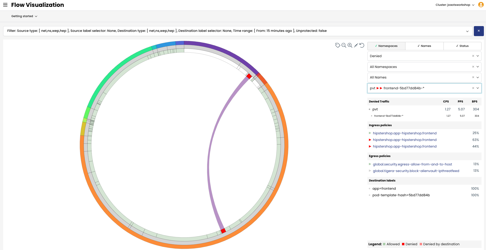
</p>

#### g. When clicking on the Security Policy, it will redirect to the Security Policy (hipstershop.app-hipstership.fronted) configuration and when looking into the ingress rules, it is configured to Log the flow and not Allow it.

<p align="center">
  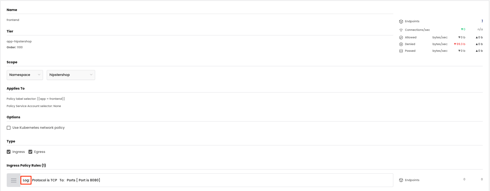
</p>

#### h. After editing the Security Policy and changing the ingress rule to Allow instead of Log, the Online Boutique is accessible again.

### LAB

#### a. Open the lab and run the script below:

```bash
/home/tigera/observability-clinic/tsworkshop/workshop1/lab-script.sh
```

#### b. Type the option “4” (LAB Break Online Boutique - Flow Visualizations) and press “Enter”

#### c. Type "99" and “Enter” to exit

#### d. Open the browser with the URL shown through the command below:

```bash
echo https://hipstershop.$(kubectl cluster-info | grep -i control | awk -F "://" '{print $2}' | cut -d. -f1).lynx.tigera.ca
```

#### e. Select any product(s), add to the Cart and click on “Place Order”.


#### f. An internal server error will return saying *“failed to get product #"OLJCESPC7Z"“*:

```nano
HTTP Status: 500 Internal Server Error
rpc error: code = Internal desc = failed to prepare order: failed to get product #"OLJCESPC7Z"
failed to complete the order
```

<p align="center">
  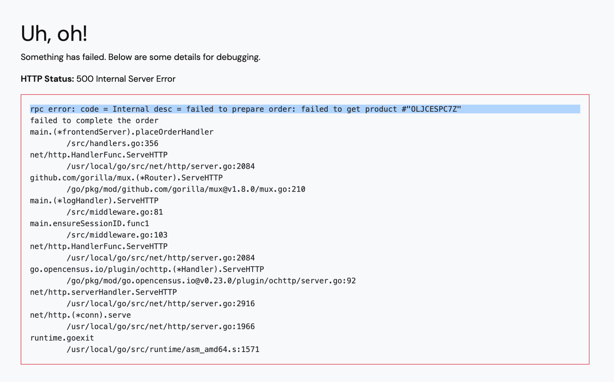
</p>

#### g. Investigate through the Flow Visualizations which flows have been denied and the Security Policy related to it, and how to fix this issue. Use the hipstershop application information provided in the **[Module 1 - Topic 4](https://github.com/tigera-cs/observability-clinic/blob/main/1.%20Overview/readme.md#4-install-hipstershop-application)**.

#### h. To revert back the misconfiguration applied, run the script and type “41” (LAB Fix Online Boutique - Flow Visualizations) and press Enter. To exit type "99" and press “Enter”.

## 3. Identify denied flows using Kibana

### Demo

#### a. Opening the lab and run the script below:

```bash
/home/tigera/observability-clinic/tsworkshop/workshop1/lab-script.sh
```

#### b. Typing the option “5” (Demo Break Online Boutique - Kibana) and press “Enter”

#### c. Type "99" and press “Enter” to exit

#### d. Opening the Online Boutique with the URL shown through the command below and Trying to access the Online Boutique we get the error: *“504 Gateway Time-out”*

```bash
echo https://hipstershop.$(kubectl cluster-info | grep -i control | awk -F "://" '{print $2}' | cut -d. -f1).lynx.tigera.ca
```

#### e. Open the Calico Cloud UI and go to Kibana by clicking in the icon 

#### f. From Kibana, there are multiple ways to track the flow and we will use a predefined dashboard hence go to Home > Analytics > Dashboard

<p align="center">
  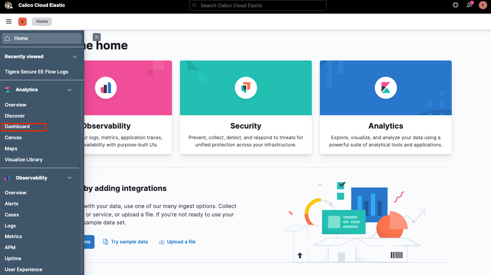
</p>

#### g. Clicking on “Tigera Secure EE Flow Logs” dashboard

<p align="center">
  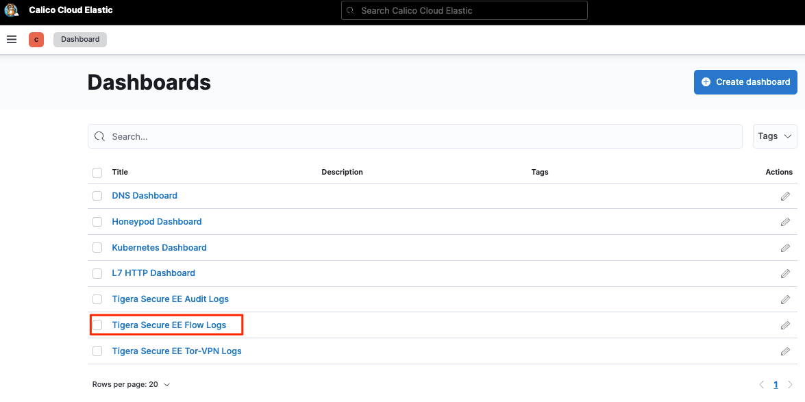
</p>

#### h. Add the filters *“action"* is *"deny"*, *"dest_namespace"* is *"hipstershop"*, *"_index"* is *"\*<name_of_cluster>\** (as per the screenshot below). Kibana will show the logs of all clusters connected then if you want to see logs from a specific cluster, it is needed to filter by _index field. 

<p align="center">
  
</p>

#### i. We can see the denied flows. 

<p align="center">
  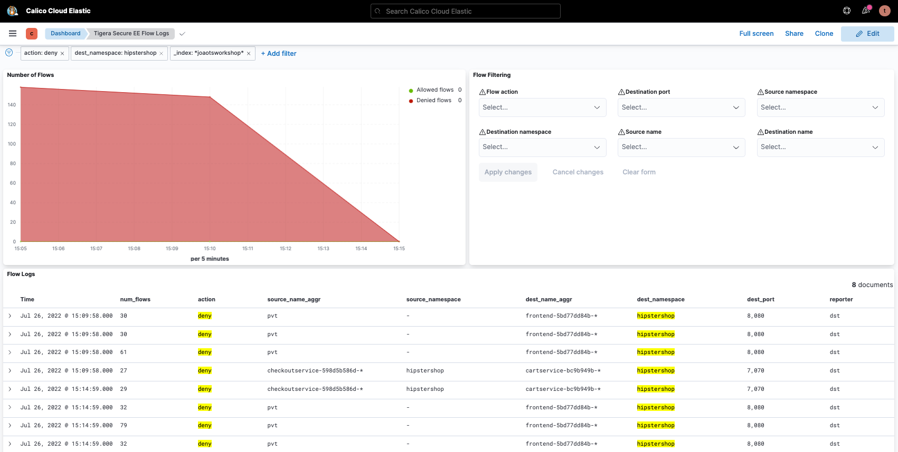
</p>

#### j. Expanding the flow logs to frontend service as it is not accessible, it shows the Security Policy *"0|security|security.tenant-histershop|deny|0"* has denied this flow.

<p align="center">
  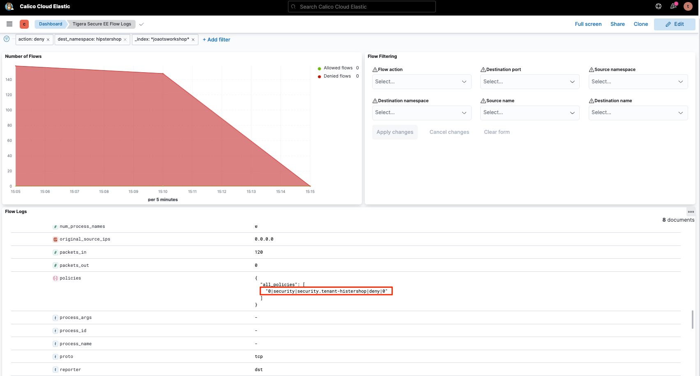
</p>

#### k. When checking on the Security Policy “tenant-hipstershop”, we can see the Ingress rule set to Deny and it should be Pass as configured in the topic **[Configure the Security and DNS Policies in the cluster](https://github.com/tigera-cs/observability-clinic/blob/main/1.%20Overview/readme.md#6-configure-the-security-and-dns-policies-in-the-cluster)**.

<p align="center">
  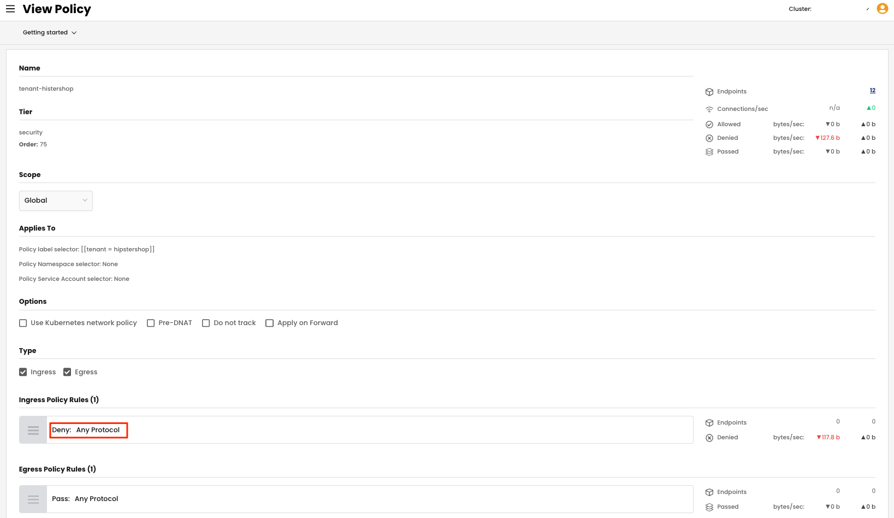
</p>

#### i. After changing the Ingress rule to ***Pass*** in the “tenant-hipstershop” Security Policy, the Online Boutique should be accessible again.

### LAB

#### a. Open the lab and run the script below:

```bash
/home/tigera/observability-clinic/tsworkshop/workshop1/lab-script.sh
```

#### b. Type the option “6” (LAB Break Online Boutique - Kibana) and press “Enter”

#### c. Type "99" and press “Enter” to exit the script

#### d. Open the browser with the URL shown through the command below:

```bash
echo https://hipstershop.$(kubectl cluster-info | grep -i control | awk -F "://" '{print $2}' | cut -d. -f1).lynx.tigera.ca
```

#### e. Select any product(s), add to the Cart and click on “Place Order”.

#### f. An internal server error will return saying “failed to get user cart during checkout”

```nano
HTTP Status: 500 Internal Server Error
rpc error: code = Internal desc = cart failure: failed to get user cart during checkout: rpc error: code = Unavailable desc = connection error: desc = "transport: Error while dialing dial tcp 10.49.114.104:7070: i/o timeout"
failed to complete the order
main.(*frontendServer).placeOrderHandler
```

<p align="center">
  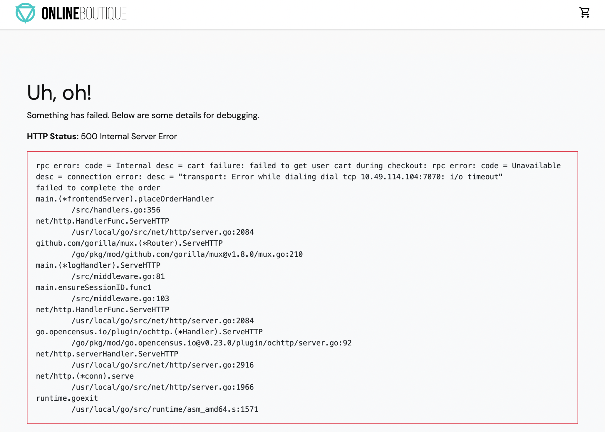
</p>

#### g. Investigate through the Kibana which flows have been denied and the Security Policy related to it, and how to fix this issue. Use the hipstershop application information provided in the **[Module 1 - Topic 4](https://github.com/tigera-cs/observability-clinic/blob/main/1.%20Overview/readme.md#4-install-hipstershop-application)**.

#### h. To revert back the misconfiguration applied, run the script and type “61” (LAB Fix Online Boutique - Kibana) and press Enter. To exit type "99" and press “Enter”.
